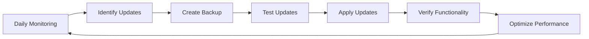

## What is Website Maintenance?

**Website maintenance is essential technical service that keeps your website functioning properly, securely, and optimally at all times.** It's not just about fixing things when they break—it's about proactive care that prevents problems before they occur.

<Info>
Think of website maintenance like car maintenance: regular oil changes, tire rotations, and inspections prevent breakdowns and keep everything running smoothly. Your website needs the same proactive care.
</Info>

## Why Maintenance is Indispensable

Websites require ongoing maintenance because:

<CardGroup cols={2}>
  <Card title="Security Threats" icon="shield-halved">
    New vulnerabilities are discovered daily. Without updates, your site becomes a target for hackers.
  </Card>
  
  <Card title="Software Updates" icon="arrow-up">
    WordPress, plugins, and themes release updates regularly. Running outdated software causes compatibility issues.
  </Card>
  
  <Card title="Performance Degradation" icon="gauge-high">
    Over time, databases grow, caches fill up, and performance degrades without regular optimization.
  </Card>
  
  <Card title="Content Relevance" icon="clock-rotate-left">
    Your content needs updates to stay relevant, accurate, and engaging for your audience.
  </Card>
</CardGroup>

## Our Maintenance Services

### Technical Service Always Available

<Card title="Always-On Support" icon="headset">
  **Technical service available to ensure your website functions always.** When something goes wrong, we're here to fix it quickly and efficiently.
</Card>

### What's Included

<AccordionGroup>
  <Accordion title="Regular Backups" icon="database">
    - **Daily automated backups** of your entire website
    - Database and file backups stored securely off-site
    - 30-day backup retention for easy restoration
    - Pre-update snapshots before any changes
    - One-click restore capability
    - Backup integrity verification
  </Accordion>
  
  <Accordion title="Software Updates" icon="download">
    - WordPress core updates (security and feature releases)
    - Plugin updates for all installed extensions
    - Theme updates to latest versions
    - PHP version upgrades when needed
    - Compatibility testing after updates
    - Rollback capability if issues arise
  </Accordion>
  
  <Accordion title="Security Monitoring" icon="shield-check">
    - 24/7 malware scanning and monitoring
    - Firewall configuration and management
    - Security patch application
    - Brute force attack prevention
    - Vulnerability scanning
    - Security incident response
  </Accordion>
  
  <Accordion title="Performance Optimization" icon="rocket">
    - Database optimization and cleanup
    - Cache management and configuration
    - Image optimization
    - Code minification
    - CDN management
    - Speed monitoring and improvements
  </Accordion>
  
  <Accordion title="Content Updates" icon="pen-to-square">
    - Text and image updates
    - Page modifications
    - Menu and navigation changes
    - Adding new pages or posts
    - Form updates
    - Contact information changes
  </Accordion>
  
  <Accordion title="Design Refreshes" icon="palette">
    - Minor design updates and improvements
    - Layout adjustments
    - Color scheme updates
    - Font and typography changes
    - Mobile responsiveness fixes
    - Visual element updates
  </Accordion>
  
  <Accordion title="Technical Support" icon="life-ring">
    - Problem diagnosis and resolution
    - Error troubleshooting
    - Plugin conflicts resolution
    - Broken link fixes
    - Form functionality testing
    - Email delivery issues
  </Accordion>
</AccordionGroup>

## Protection and Recovery

<Steps>
  <Step title="Proactive Protection">
    We actively monitor your site for security threats, performance issues, and potential problems before they impact your visitors.
  </Step>
  
  <Step title="Attack Prevention">
    Multiple layers of security protect against common attacks: malware, DDoS, brute force, SQL injection, and cross-site scripting.
  </Step>
  
  <Step title="Rapid Restoration">
    If an incident occurs, we can quickly restore your website from recent backups, minimizing downtime and data loss.
  </Step>
</Steps>

## Maintenance Workflow

### How We Keep Your Site Running

<Note>
All maintenance work is performed during low-traffic periods to minimize any potential impact on your visitors.
</Note>

## Benefits of Our Maintenance Service

### Optimal Performance Guaranteed

With our maintenance service, your website:

<CardGroup cols={2}>
  <Card title="Stays Fast" icon="gauge-high">
    Regular optimization ensures your site loads quickly and performs well.
  </Card>
  
  <Card title="Remains Secure" icon="lock">
    Constant security updates protect against the latest threats.
  </Card>
  
  <Card title="Stays Current" icon="arrows-rotate">
    Your content and design stay fresh and up-to-date.
  </Card>
  
  <Card title="Runs 24/7" icon="clock">
    Minimal downtime with proactive monitoring and quick issue resolution.
  </Card>
</CardGroup>

### Peace of Mind

You can focus on your business while we handle:

- All technical complexities
- Security and updates
- Performance optimization
- Backup management
- Emergency support
- Content updates

## What We Monitor

### Continuous Site Monitoring

<Tabs>
  <Tab title="Uptime">
    - 24/7 availability monitoring
    - Instant downtime alerts
    - Server response time tracking
    - SSL certificate monitoring
    - Domain expiration tracking
  </Tab>
  
  <Tab title="Security">
    - Malware scanning
    - Vulnerability detection
    - Failed login attempts
    - File integrity monitoring
    - Blacklist status checking
  </Tab>
  
  <Tab title="Performance">
    - Page load speed
    - Server resource usage
    - Database performance
    - Cache effectiveness
    - CDN functionality
  </Tab>
  
  <Tab title="Functionality">
    - Form submissions
    - E-commerce transactions
    - Search functionality
    - User registration
    - Email delivery
  </Tab>
</Tabs>

## Emergency Support

### When Things Go Wrong

Critical issues receive **immediate attention**:

- **Site Down**: Rapid response to restore functionality
- **Security Breach**: Immediate malware removal and security hardening
- **Data Loss**: Quick restoration from backups
- **Critical Errors**: Fast diagnosis and resolution
- **Performance Issues**: Urgent optimization to restore speed

<Warning>
**Emergency Response**: For critical issues affecting site availability or security, we provide emergency support outside regular hours.
</Warning>

## Maintenance Included in Hosting

<Info>
Annual maintenance is **included** in our €149/year hosting package at no additional cost.
</Info>

The hosting package includes:

- All maintenance services listed above
- Domain registration and management
- Optimized WordPress hosting
- Daily backups
- Technical support
- Security protection

## Update Schedule

### Regular Maintenance Cycles

| Task | Frequency |
|------|----------|
| Security Updates | As released (immediate for critical) |
| Plugin Updates | Weekly |
| WordPress Core Updates | As released (tested first) |
| Database Optimization | Weekly |
| Backup Verification | Weekly |
| Performance Review | Monthly |
| Full Site Audit | Quarterly |
| Content Review | As needed |

## Content Update Requests

### How to Request Updates

Need content or design changes? Here's how:

<Steps>
  <Step title="Contact Us">
    Send us your update request via email, WhatsApp, or phone.
  </Step>
  
  <Step title="Provide Details">
    Let us know what needs to change, updated content, or new requirements.
  </Step>
  
  <Step title="We Implement">
    We make the changes and test thoroughly.
  </Step>
  
  <Step title="Review & Approve">
    You review the changes and we make any adjustments needed.
  </Step>
</Steps>

<Note>
**Response Time**: Minor updates are typically completed within 24-48 hours. Larger changes may require more time depending on complexity.
</Note>

## Maintenance Reports

### Stay Informed

We provide regular reports on:

- Updates applied
- Security scans performed
- Performance metrics
- Backup status
- Issues resolved
- Recommendations for improvements

## Why Maintenance Can't Be Skipped

<Warning>
**Without Regular Maintenance:**
- Security vulnerabilities put your site at risk
- Performance degrades over time
- Compatibility issues break functionality
- Backups become outdated
- Recovery becomes more difficult
- SEO rankings can decline
- User experience suffers
</Warning>

## Investment Protection

Your website is a valuable business asset. Maintenance protects your investment by:

- Preventing expensive emergency repairs
- Avoiding data loss and recovery costs
- Maintaining SEO rankings and traffic
- Ensuring consistent user experience
- Extending the life of your website
- Reducing long-term costs

## Get Started

<Card title="Start Your Maintenance Plan" icon="handshake" href="/getting-help">
  Contact us to discuss your website maintenance needs and ensure your site always runs perfectly.
</Card>

<Tip>
**Best Practice**: Even if you're not hosting with us, regular maintenance is crucial. Ask us about standalone maintenance plans for externally hosted sites.
</Tip>