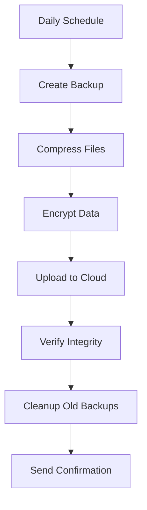

## Why Backups Are Critical

Your website contains valuable business data, content, customer information, and years of work. **Backups are your safety net** when something goes wrong.

<Warning>
**Without backups, you risk losing:**
- All website content and images
- Customer data and orders
- Email history and contacts
- Years of blog posts and articles
- Custom configurations and settings
- SEO rankings and traffic history
</Warning>

## When You Need Backups

Backups protect you from various disaster scenarios:

<CardGroup cols={2}>
  <Card title="Security Breaches" icon="user-secret">
    Malware, hacking, or security compromises that damage your site files or database.
  </Card>
  
  <Card title="Human Error" icon="hand">
    Accidental deletions, incorrect updates, or mistakes during content changes.
  </Card>
  
  <Card title="Failed Updates" icon="triangle-exclamation">
    Plugin or theme updates that break functionality or cause compatibility issues.
  </Card>
  
  <Card title="Server Issues" icon="server">
    Hardware failures, data corruption, or hosting provider problems.
  </Card>
  
  <Card title="Software Conflicts" icon="code">
    Plugin conflicts or bugs that corrupt data or break the site.
  </Card>
  
  <Card title="Database Corruption" icon="database">
    Database errors that cause data loss or site malfunction.
  </Card>
</CardGroup>

## Our Backup Solution

### Automated Daily Backups

<Info>
We perform **daily automated backups** of your entire website, including all files, databases, themes, plugins, and configurations.
</Info>

### What We Backup

<AccordionGroup>
  <Accordion title="Complete Website Files">
    - All WordPress core files
    - All theme files and customizations
    - All plugin files and configurations
    - Media library (images, videos, documents)
    - Custom code and scripts
    - Configuration files (.htaccess, wp-config.php)
  </Accordion>
  
  <Accordion title="Full Database">
    - All pages and posts
    - All comments and metadata
    - All user accounts and permissions
    - All plugin settings and data
    - All custom post types
    - All navigation menus and widgets
  </Accordion>
  
  <Accordion title="Email Data">
    - Email accounts
    - Email configurations
    - Forwarders and filters (if applicable)
    - Autoresponders
  </Accordion>
</AccordionGroup>

## Backup Features

### 30-Day Retention

<Card title="Comprehensive History" icon="calendar">
  We retain **30 days of daily backups**, giving you multiple restore points to choose from if you need to recover your site.
</Card>

This means you can:

- Restore to yesterday's version
- Go back a week if needed
- Recover from issues discovered later
- Access older versions of deleted content
- Compare different versions of your site

### Off-Site Storage

<Card title="Secure Remote Storage" icon="cloud">
  All backups are stored **off-site** in secure cloud storage, separate from your hosting server. This protects against server failures, data center issues, or complete hosting provider problems.
</Card>

### Pre-Update Snapshots

Before any major changes, we create snapshots:

<Steps>
  <Step title="Before Updates">
    Automatic backup before WordPress, plugin, or theme updates.
  </Step>
  
  <Step title="Before Changes">
    Manual backup before significant content or design modifications.
  </Step>
  
  <Step title="Before Migrations">
    Complete backup before server migrations or major infrastructure changes.
  </Step>
</Steps>

## Backup Process

### How Our Automated Backups Work

<Note>
Backups run during low-traffic periods (typically late night) to minimize any performance impact on your live site.
</Note>

## One-Click Restore

### Fast Recovery When You Need It

Our backup system includes **one-click restore functionality**:

<Tabs>
  <Tab title="Full Site Restore">
    Restore your entire website to any backup point:
    
    1. Select the backup date/time
    2. Confirm restore action
    3. System restores all files and database
    4. Verify site functionality
    5. You're back online
    
    **Typical restore time**: 15-30 minutes
  </Tab>
  
  <Tab title="Selective Restore">
    Restore specific files or database tables:
    
    - Recover a single deleted page
    - Restore specific images
    - Recover database tables
    - Restore plugin configurations
    - Retrieve old content versions
    
    **Typical restore time**: 5-15 minutes
  </Tab>
  
  <Tab title="Emergency Restore">
    For critical situations:
    
    - Immediate response
    - Priority restoration
    - Site stabilization
    - Data verification
    - Security checks
    
    **Response time**: Within 1 hour
  </Tab>
</Tabs>

## Backup Verification

### Ensuring Backup Integrity

We don't just create backups—we verify they work:

<CardGroup cols={2}>
  <Card title="Automated Testing" icon="vial">
    Regular automated verification that backups are complete and restorable.
  </Card>
  
  <Card title="Integrity Checks" icon="check-double">
    File integrity verification to ensure backups aren't corrupted.
  </Card>
  
  <Card title="Test Restores" icon="flask">
    Periodic test restores to staging environments to verify functionality.
  </Card>
  
  <Card title="Size Monitoring" icon="chart-line">
    Monitoring backup sizes to detect missing files or incomplete backups.
  </Card>
</CardGroup>

<Warning>
**Important**: A backup is only as good as your ability to restore it. That's why we regularly test our backup restoration process.
</Warning>

## Backup Security

### Protecting Your Backup Data

Your backup data is secured with multiple layers of protection:

- **Encryption**: All backups are encrypted during transmission and storage
- **Access Control**: Restricted access with multi-factor authentication
- **Secure Storage**: Enterprise-grade cloud storage with redundancy
- **Privacy**: Your data never leaves secure, GDPR-compliant infrastructure
- **Audit Logs**: Complete logs of all backup and restore operations

## Real-World Recovery Scenarios

<AccordionGroup>
  <Accordion title="Scenario: Hacked Website">
    **Problem**: Site infected with malware after security breach.
    
    **Solution**:
    1. Take site offline to prevent further damage
    2. Identify the point of compromise
    3. Restore from clean backup before infection
    4. Apply security patches
    5. Scan and verify clean restoration
    6. Bring site back online
    
    **Recovery time**: 2-4 hours
  </Accordion>
  
  <Accordion title="Scenario: Failed Plugin Update">
    **Problem**: Plugin update breaks critical functionality.
    
    **Solution**:
    1. Identify the problematic plugin
    2. Restore from pre-update snapshot
    3. Update other plugins individually
    4. Find alternative to problematic plugin
    5. Verify all functionality
    
    **Recovery time**: 30 minutes - 1 hour
  </Accordion>
  
  <Accordion title="Scenario: Accidental Content Deletion">
    **Problem**: Important page accidentally deleted and trash emptied.
    
    **Solution**:
    1. Locate backup containing the page
    2. Extract specific page data
    3. Restore just that page
    4. Verify content and functionality
    5. No disruption to current site
    
    **Recovery time**: 15-30 minutes
  </Accordion>
  
  <Accordion title="Scenario: Server Failure">
    **Problem**: Complete hosting server failure with data loss.
    
    **Solution**:
    1. Provision new server environment
    2. Restore complete site from off-site backup
    3. Update DNS to point to new server
    4. Verify all functionality
    5. Monitor performance
    
    **Recovery time**: 4-8 hours
  </Accordion>
</AccordionGroup>

## Backup Monitoring

### We Keep Watch on Your Backups

Our team monitors backup health:

- **Success Verification**: Confirm each backup completes successfully
- **Failure Alerts**: Immediate notification if a backup fails
- **Size Anomalies**: Detect unusual backup size changes
- **Schedule Adherence**: Ensure backups run on schedule
- **Storage Capacity**: Monitor storage space availability

<Note>
If a backup fails, we're notified immediately and take action to create a manual backup and resolve the issue.
</Note>

## Backup Best Practices

### 3-2-1 Backup Strategy

We follow industry best practices:

<Steps>
  <Step title="3 Copies">
    Keep **3 copies** of your data: production site + 2 backup copies.
  </Step>
  
  <Step title="2 Different Media">
    Store backups on **2 different types** of storage media for redundancy.
  </Step>
  
  <Step title="1 Off-Site">
    Keep **1 copy off-site** to protect against local disasters.
  </Step>
</Steps>

## What's Included

<Info>
**Backup service is included** in our €149/year hosting package at no additional cost.
</Info>

Your hosting package includes:

- Daily automated backups
- 30-day backup retention
- Off-site secure storage
- One-click restore capability
- Pre-update snapshots
- Backup monitoring and verification
- Emergency restoration support
- Technical support for recovery

## Backup Schedule

| Backup Type | Frequency | Retention |
|-------------|-----------|----------|
| Full Site Backup | Daily (3:00 AM) | 30 days |
| Database Backup | Daily (3:00 AM) | 30 days |
| Pre-Update Snapshot | Before each update | Until next update |
| Manual Backup | On request | Permanent (until deletion) |
| Monthly Archive | First of month | 12 months |

## Requesting Manual Backups

Need a backup outside the regular schedule?

<Card title="Request Manual Backup" icon="floppy-disk">
  Contact us anytime to request an immediate manual backup before making significant changes to your site.
</Card>

Common reasons for manual backups:

- Before major design changes
- Before bulk content updates
- Before installing new plugins
- Before testing new functionality
- Before migration or upgrades
- For peace of mind

## Restore Requests

### How to Request a Restore

If you need to restore from backup:

<Steps>
  <Step title="Contact Us">
    Reach out via email, phone, or WhatsApp immediately.
  </Step>
  
  <Step title="Describe the Issue">
    Explain what happened and what needs to be restored.
  </Step>
  
  <Step title="Specify Date/Time">
    If possible, indicate when the site was last working correctly.
  </Step>
  
  <Step title="We Assess">
    We evaluate the situation and recommend the best restore point.
  </Step>
  
  <Step title="We Restore">
    We perform the restoration and verify everything works.
  </Step>
  
  <Step title="You Verify">
    You confirm the site is back to normal.
  </Step>
</Steps>

<Warning>
**Time is Critical**: Contact us immediately when you notice a problem. The sooner we can restore, the less data or content you'll lose.
</Warning>

## Backup Reports

We provide backup status information:

- Last successful backup date/time
- Backup file sizes
- Number of backups available
- Storage space used
- Any backup issues or failures
- Restoration history

## Additional Backup Services

### Enhanced Backup Options

<CardGroup cols={2}>
  <Card title="Extended Retention" icon="calendar-plus">
    Keep backups for 60, 90, or 180 days for additional protection.
  </Card>
  
  <Card title="More Frequent Backups" icon="clock">
    Hourly or twice-daily backups for high-traffic or frequently updated sites.
  </Card>
  
  <Card title="Downloadable Backups" icon="download">
    Access to download your own backup copies for local storage.
  </Card>
  
  <Card title="Staging Site" icon="copy">
    Automatic staging site creation from backups for safe testing.
  </Card>
</CardGroup>

<Note>
Contact us to discuss enhanced backup options for sites with special requirements.
</Note>

## Get Started

<Card title="Protect Your Website" icon="shield" href="/getting-help">
  Contact us to ensure your website is protected with comprehensive backup solutions.
</Card>

<Tip>
**Peace of Mind**: With our backup solution, you can sleep well knowing your website can be recovered from any disaster.
</Tip>