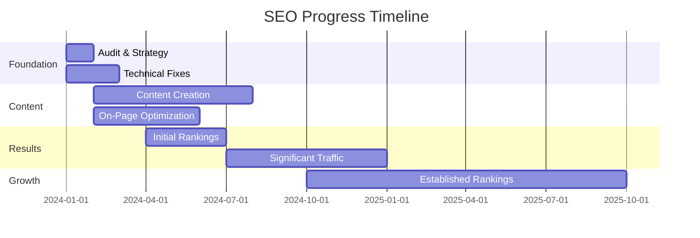

## SEO Orgánico (Organic SEO)

Organic SEO is the foundation of long-term online visibility and success. Unlike paid advertising, **organic SEO positions your website naturally in search results without paying for clicks**.

<Info>
**Timeline**: SEO is a **medium to long-term strategy**. Results typically begin showing in 3-6 months, with significant improvements in 6-12 months.
</Info>

## Why SEO Matters

<CardGroup cols={2}>
  <Card title="Sustainable Traffic" icon="chart-line">
    Once established, organic rankings provide consistent, free traffic to your website without ongoing ad costs.
  </Card>
  
  <Card title="Trust and Credibility" icon="badge-check">
    Users trust organic search results more than paid ads. High rankings signal authority and legitimacy.
  </Card>
  
  <Card title="Better ROI" icon="hand-holding-dollar">
    While SEO requires upfront investment, the long-term return far exceeds paid advertising costs.
  </Card>
  
  <Card title="Competitive Advantage" icon="trophy">
    Outranking competitors means capturing the customers they're missing.
  </Card>
</CardGroup>

## How Organic SEO Works

### Google's Ranking Criteria

The **importance of good organic positioning (SEO) in search engines according to Google's guidelines is key** to online success. Google evaluates hundreds of factors, but the most important are:

<Tabs>
  <Tab title="Content Quality">
    **High-quality content is the foundation of SEO:**
    
    - Comprehensive, valuable information
    - Original, unique content
    - Regular updates and freshness
    - Proper keyword usage
    - User-focused writing
    - Answers to user questions
    - Engaging and readable format
  </Tab>
  
  <Tab title="Technical SEO">
    **Technical excellence supports rankings:**
    
    - Fast page load speed
    - Mobile-friendly design
    - Secure HTTPS connection
    - Clean, crawlable code
    - Proper URL structure
    - XML sitemaps
    - Schema markup
  </Tab>
  
  <Tab title="User Experience">
    **Google prioritizes user satisfaction:**
    
    - Intuitive navigation
    - Low bounce rate
    - High engagement time
    - Clear call-to-actions
    - Accessible design
    - Professional appearance
    - Cross-device compatibility
  </Tab>
  
  <Tab title="Authority & Links">
    **Building website authority:**
    
    - Quality backlinks
    - Domain authority
    - Brand mentions
    - Social signals
    - Expert authorship
    - Industry recognition
    - Trust indicators
  </Tab>
</Tabs>

## Our SEO Approach

### Comprehensive SEO Strategy

**SEO campaigns involve no payments to Google**—instead, we focus on optimizing your website and content to earn high rankings naturally.

<Steps>
  <Step title="SEO Audit & Research">
    - Analyze your current website performance
    - Identify technical SEO issues
    - Research competitor strategies
    - Keyword research and opportunity analysis
    - Define target audience and intent
  </Step>
  
  <Step title="Technical Optimization">
    - Fix technical SEO issues
    - Optimize site speed and performance
    - Ensure mobile responsiveness
    - Implement schema markup
    - Improve site architecture
    - Set up proper redirects
  </Step>
  
  <Step title="Content Strategy">
    - Develop keyword-targeted content plan
    - Create high-quality, valuable content
    - Optimize existing pages
    - Build comprehensive resource pages
    - Regular blog content creation
    - Content refresh and updates
  </Step>
  
  <Step title="On-Page Optimization">
    - Optimize title tags and meta descriptions
    - Improve heading structure (H1, H2, H3)
    - Optimize images with alt text
    - Internal linking strategy
    - URL optimization
    - Content formatting for readability
  </Step>
  
  <Step title="Authority Building">
    - Create linkable assets
    - Outreach for quality backlinks
    - Guest posting opportunities
    - Digital PR campaigns
    - Build brand mentions
    - Industry partnerships
  </Step>
  
  <Step title="Monitoring & Refinement">
    - Track rankings and traffic
    - Analyze user behavior
    - Identify improvement opportunities
    - Adjust strategy based on data
    - Continuous optimization
    - Regular reporting
  </Step>
</Steps>

## Key SEO Services

<AccordionGroup>
  <Accordion title="Keyword Research & Strategy">
    Identifying the right keywords is crucial for SEO success:
    
    - **Search Volume Analysis**: Find keywords with sufficient search traffic
    - **Competition Assessment**: Balance between search volume and ranking difficulty
    - **Intent Mapping**: Match keywords to user intent (informational, commercial, transactional)
    - **Long-tail Keywords**: Target specific, lower-competition phrases
    - **Local Keywords**: Optimize for location-based searches
    - **Semantic Keywords**: Include related terms and synonyms
  </Accordion>
  
  <Accordion title="Content Creation & Optimization">
    Content is the vehicle that carries your SEO strategy:
    
    - **Blog Posts**: Regular, valuable content targeting specific keywords
    - **Service Pages**: Comprehensive descriptions of your offerings
    - **Resource Guides**: In-depth content that attracts links
    - **FAQs**: Answer common questions your customers have
    - **Case Studies**: Demonstrate your expertise and results
    - **Content Refresh**: Update older content to maintain rankings
    
    **The positioning time depends on the creation and content of your website**—more content, better content, faster results.
  </Accordion>
  
  <Accordion title="Technical SEO">
    Behind-the-scenes optimization that enables rankings:
    
    - **Site Speed Optimization**: Fast loading for better user experience and rankings
    - **Mobile Optimization**: Ensure perfect mobile experience
    - **Crawlability**: Help search engines understand your site
    - **Structured Data**: Implement schema markup for rich results
    - **XML Sitemaps**: Guide search engines to your important pages
    - **Robots.txt**: Control search engine access
    - **Canonical URLs**: Prevent duplicate content issues
  </Accordion>
  
  <Accordion title="Local SEO">
    For businesses serving local customers:
    
    - **Google Business Profile**: Optimize your local listing
    - **Local Citations**: Consistent NAP (Name, Address, Phone) across directories
    - **Local Content**: Create location-specific pages and content
    - **Reviews Management**: Encourage and respond to customer reviews
    - **Local Link Building**: Earn links from local websites
    - **Location Pages**: Dedicated pages for each service area
  </Accordion>
  
  <Accordion title="Link Building">
    Earning quality backlinks from authoritative websites:
    
    - **Content Marketing**: Create linkable content assets
    - **Digital PR**: Earn media coverage and mentions
    - **Guest Posting**: Contribute to industry publications
    - **Resource Links**: Get listed in industry directories
    - **Broken Link Building**: Replace broken links with your content
    - **Partnership Links**: Collaborate with complementary businesses
  </Accordion>
</AccordionGroup>

## SEO Timeline & Expectations

### What to Expect

<Warning>
**SEO is not instant.** Anyone promising immediate rankings is misleading you. Sustainable SEO takes time but delivers lasting results.
</Warning>

**Typical SEO Timeline:**

- **Months 1-2**: Foundation work (audit, strategy, technical fixes)
- **Months 3-4**: Content creation and optimization begins showing initial results
- **Months 5-6**: Rankings improve, traffic increases noticeably
- **Months 7-12**: Significant traffic growth and established rankings
- **12+ Months**: Sustained, growing organic traffic and authority

<Note>
Timeline varies based on competition level, website starting point, and consistency of SEO efforts.
</Note>

## SEO vs. SEM (Paid Ads)

### Understanding the Difference

| Aspect | SEO (Organic) | SEM (Paid Ads) |
|--------|---------------|----------------|
| **Cost** | Time and content investment | Pay per click |
| **Timeline** | 3-12 months for results | Immediate traffic |
| **Sustainability** | Long-term, lasting results | Traffic stops when budget ends |
| **Trust** | High user trust | Lower trust (marked as ads) |
| **ROI** | Better long-term ROI | Good for immediate needs |
| **Click-through** | Higher click-through rates | Lower rates than organic |
| **Competition** | Based on content quality | Based on budget |

<Tip>
**Best Strategy**: Combine both! Use paid ads for immediate results while building long-term SEO. As SEO improves, reduce ad spend.
</Tip>

## Our SEO Process

### Proven Methodology

<CardGroup cols={2}>
  <Card title="Data-Driven" icon="chart-mixed">
    Every decision backed by analytics, search data, and performance metrics.
  </Card>
  
  <Card title="White-Hat Only" icon="circle-check">
    We follow Google's guidelines strictly—no black-hat tactics that risk penalties.
  </Card>
  
  <Card title="Transparent Reporting" icon="file-chart-line">
    Regular reports showing rankings, traffic, and progress toward goals.
  </Card>
  
  <Card title="Continuous Improvement" icon="arrows-rotate">
    SEO is ongoing. We continuously refine and improve your strategy.
  </Card>
</CardGroup>

## What We Don't Do

<Warning>
**Black-Hat SEO Tactics We Avoid:**

- Keyword stuffing
- Hidden text or links
- Paid link schemes
- Duplicate or scraped content
- Cloaking or sneaky redirects
- Automated content generation
- Link farms or PBNs

These tactics may show short-term gains but result in severe Google penalties and long-term damage.
</Warning>

## Content Creation for SEO

Content is the cornerstone of SEO success:

### Blog Strategy

<Card title="Regular Blog Content" icon="pen-fancy">
  **Keep your website active with blog publications.** Regular blog posts targeting keywords and answering customer questions build authority and attract traffic.
</Card>

### Content Types That Drive SEO

- **How-to Guides**: Step-by-step instructions
- **Ultimate Guides**: Comprehensive resources on topics
- **Comparison Articles**: "X vs. Y" content
- **Listicles**: "Top 10 ways to..." posts
- **Case Studies**: Real-world examples and results
- **Industry News**: Stay current and relevant
- **FAQ Content**: Answer common questions

## Measuring SEO Success

### Key Performance Indicators

We track and report on:

<Tabs>
  <Tab title="Rankings">
    - Target keyword positions
    - Ranking improvements over time
    - Number of keywords in top 10
    - Featured snippet captures
    - Local pack rankings
  </Tab>
  
  <Tab title="Traffic">
    - Organic traffic growth
    - New vs. returning visitors
    - Geographic traffic distribution
    - Landing page performance
    - Traffic by device type
  </Tab>
  
  <Tab title="Engagement">
    - Time on site
    - Pages per session
    - Bounce rate
    - Conversion rate
    - Goal completions
  </Tab>
  
  <Tab title="Authority">
    - Domain authority score
    - Backlink growth
    - Referring domains
    - Brand mentions
    - Social signals
  </Tab>
</Tabs>

## Local SEO for Spanish Businesses

Special considerations for businesses in Spain:

- **Google Business Profile**: Essential for local visibility
- **Spanish Keywords**: Optimize for Spanish search terms
- **Local Directories**: Get listed in Spanish business directories
- **Local Content**: Create content relevant to your Spanish audience
- **Local Links**: Build relationships with Spanish websites
- **Regional Targeting**: Target specific autonomous communities or cities

## SEO for E-commerce

Online stores require specialized SEO:

- **Product Page Optimization**: Unique descriptions, images, reviews
- **Category Structure**: Logical hierarchy and internal linking
- **Schema Markup**: Product, price, and review structured data
- **Site Speed**: Fast loading for better conversions
- **Mobile Experience**: Seamless mobile shopping
- **Content Strategy**: Blog and guides to attract top-of-funnel traffic

## Get Started with SEO

<Steps>
  <Step title="Contact Us">
    Reach out to discuss your business, goals, and current website status.
  </Step>
  
  <Step title="Free SEO Audit">
    We'll analyze your website and identify opportunities for improvement.
  </Step>
  
  <Step title="Custom Strategy">
    We develop a tailored SEO strategy for your specific business and goals.
  </Step>
  
  <Step title="Implementation">
    We begin optimizing your site and creating content to drive rankings.
  </Step>
  
  <Step title="Monitor & Grow">
    Track progress, adjust strategy, and watch your organic traffic grow.
  </Step>
</Steps>

<Card title="Start Your SEO Journey" icon="rocket" href="/getting-help">
  Contact us for a free SEO audit and discussion about how we can help you rank higher and attract more customers.
</Card>

<Tip>
**Best Time to Start SEO**: Yesterday. The second best time is today. The earlier you start, the sooner you'll see results.
</Tip>